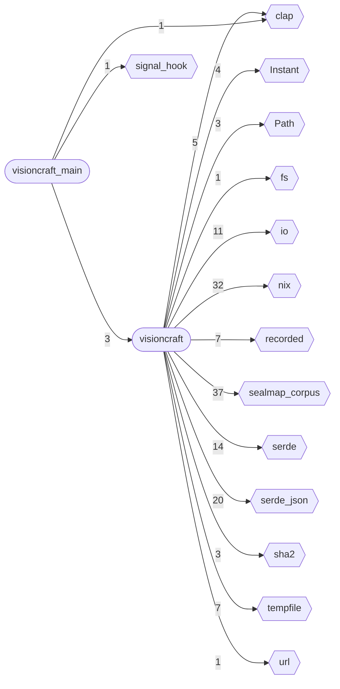
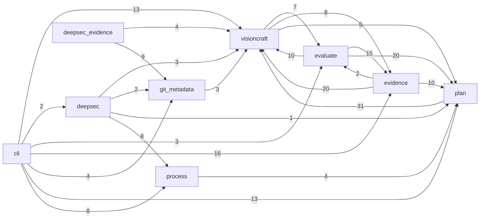

# visioncraft overview
10 files · 182 symbols · 691 relations · 90 flows · 583 calls

## crates

```mermaid
flowchart LR
  visioncraft(["visioncraft"])
  visioncraft_main(["visioncraft_main"])
  Instant{{"Instant"}}
  Path{{"Path"}}
  clap{{"clap"}}
  fs{{"fs"}}
  io{{"io"}}
  nix{{"nix"}}
  recorded{{"recorded"}}
  sealmap_corpus{{"sealmap_corpus"}}
  serde{{"serde"}}
  serde_json{{"serde_json"}}
  sha2{{"sha2"}}
  signal_hook{{"signal_hook"}}
  tempfile{{"tempfile"}}
  url{{"url"}}
  visioncraft -->|"4"| Instant
  visioncraft -->|"3"| Path
  visioncraft -->|"5"| clap
  visioncraft -->|"1"| fs
  visioncraft -->|"11"| io
  visioncraft -->|"32"| nix
  visioncraft -->|"7"| recorded
  visioncraft -->|"37"| sealmap_corpus
  visioncraft -->|"14"| serde
  visioncraft -->|"20"| serde_json
  visioncraft -->|"3"| sha2
  visioncraft -->|"7"| tempfile
  visioncraft -->|"1"| url
  visioncraft_main -->|"1"| clap
  visioncraft_main -->|"1"| signal_hook
  visioncraft_main -->|"3"| visioncraft
```

## modules: visioncraft

```mermaid
flowchart LR
  visioncraft["visioncraft"]
  visioncraft__cli["cli"]
  visioncraft__deepsec["deepsec"]
  visioncraft__deepsec_evidence["deepsec_evidence"]
  visioncraft__evaluate["evaluate"]
  visioncraft__evidence["evidence"]
  visioncraft__git_metadata["git_metadata"]
  visioncraft__plan["plan"]
  visioncraft__process["process"]
  visioncraft -->|"7"| visioncraft__evaluate
  visioncraft -->|"8"| visioncraft__evidence
  visioncraft -->|"9"| visioncraft__plan
  visioncraft__cli -->|"13"| visioncraft
  visioncraft__cli -->|"2"| visioncraft__deepsec
  visioncraft__cli -->|"3"| visioncraft__evaluate
  visioncraft__cli -->|"16"| visioncraft__evidence
  visioncraft__cli -->|"4"| visioncraft__git_metadata
  visioncraft__cli -->|"13"| visioncraft__plan
  visioncraft__cli -->|"8"| visioncraft__process
  visioncraft__deepsec -->|"3"| visioncraft
  visioncraft__deepsec -->|"2"| visioncraft__git_metadata
  visioncraft__deepsec -->|"1"| visioncraft__plan
  visioncraft__deepsec -->|"8"| visioncraft__process
  visioncraft__deepsec_evidence -->|"4"| visioncraft
  visioncraft__deepsec_evidence -->|"9"| visioncraft__git_metadata
  visioncraft__evaluate -->|"10"| visioncraft
  visioncraft__evaluate -->|"15"| visioncraft__evidence
  visioncraft__evaluate -->|"20"| visioncraft__plan
  visioncraft__evidence -->|"20"| visioncraft
  visioncraft__evidence -->|"2"| visioncraft__evaluate
  visioncraft__evidence -->|"10"| visioncraft__plan
  visioncraft__git_metadata -->|"3"| visioncraft
  visioncraft__plan -->|"31"| visioncraft
  visioncraft__process -->|"4"| visioncraft__plan
```

## data: visioncraft

```mermaid
erDiagram
  visioncraft__cli___tCli["Cli"] {
    Operation command
  }
  visioncraft__cli___tContextFile["ContextFile"] {
    Vec[AuditReceipt] audits
    Vec[ManualObservation] manual_observations
    Vec[FamilyDeclaration] families
  }
  visioncraft__cli___tEvaluateOptions["EvaluateOptions"] {
    PathBuf plan
    PathBuf root
    Vec[PathBuf] receipts
    Option[PathBuf] context
    Option[PathBuf] current_subject
    Option[u64] as_of_ms
    bool json
  }
  visioncraft__cli___tExpectationCommand["ExpectationCommand"]
  visioncraft__cli___tFamilyDeclaration["FamilyDeclaration"] {
    String route
    String family
  }
  visioncraft__cli___tGateCommand["GateCommand"]
  visioncraft__cli___tInitOptions["InitOptions"] {
    PathBuf root
    PathBuf out
    Vec[String] input
    String id
    String check
    Option[String] repository
    String configuration
    String cwd
    Vec[String] env
    u64 timeout_ms
    u64 max_output_bytes
    Vec[String] command
  }
  visioncraft__cli___tOperation["Operation"]
  visioncraft__cli___tPlanCommand["PlanCommand"]
  visioncraft__cli___tRunOptions["RunOptions"] {
    PathBuf plan
    PathBuf root
    Option[String] check
    bool all
    PathBuf out
  }
  visioncraft__deepsec___tAttempt["Attempt"] {
    __aDeepsecPolicy policy "&'a DeepsecPolicy"
    __aPath report "&'a Path"
    __aAtomicBool cancelled "&'a AtomicBool"
    Instant started
    Duration deadline
    u32 sequence
  }
  visioncraft__deepsec___tDeepsecOptions["DeepsecOptions"] {
    Option[String] diff
    bool diff_working
    bool diff_staged
    Option[PathBuf] files_from
    bool full
    bool scan_only
    Option[PathBuf] root
    Option[PathBuf] report_dir
    Option[String] policy_json
    Option[String] fail_on
    Option[String] thinking_level
    Option[String] agent
    Option[String] model
    Option[String] model_auth
    bool dry_run
  }
  visioncraft__deepsec___tDeepsecPolicy["DeepsecPolicy"] {
    bool enabled
    String agent
    String model_auth
    String model
    String thinking_level
    String fail_on
    String max_duration
    u32 batch_size
    u32 concurrency
    String ai_provider
    String ai_api_key_env
    String ai_base_url
    String policy_source
    u64 max_output_bytes
  }
  visioncraft__evaluate___tCheckOutcome["CheckOutcome"]
  visioncraft__evaluate___tCheckReport["CheckReport"] {
    String id
    bool required
    Option[String] attempt_id
    CheckOutcome outcome
    Vec[String] reasons
  }
  visioncraft__evaluate___tEvaluationContext["EvaluationContext"] {
    u64 now_ms
    __aSubject current_subject "&'a Subject"
    __aVerifiedArtifacts verified "&'a VerifiedArtifacts"
    __a[String] ancestor_revisions "&'a [String]"
    FamilyCatalogue families
    __a[AuditReceipt] audits "&'a [AuditReceipt]"
    __a[ManualObservation] manual_observations "&'a [ManualObservation]"
  }
  visioncraft__evaluate___tExpectationReport["ExpectationReport"] {
    String id
    bool required
    CheckOutcome outcome
    Vec[String] reasons
  }
  visioncraft__evaluate___tGateOutcome["GateOutcome"]
  visioncraft__evaluate___tGateReport["GateReport"] {
    GateOutcome outcome
    usize required_checks
    usize passed_required_checks
    Vec[CheckReport] checks
    Vec[ExpectationReport] expectations
    Vec[String] errors
  }
  visioncraft__evidence___tActor["Actor"] {
    String agent_id
    String attempt_id
    String model
  }
  visioncraft__evidence___tAuditReceipt["AuditReceipt"] {
    String expectation_id
    String plan_sha256
    Subject subject
    Actor producer
    Actor reviewer
    String probe_check
    AuditVerdict verdict
    String observed
    Artifact artifact
    u64 captured_at_ms
  }
  visioncraft__evidence___tAuditVerdict["AuditVerdict"]
  visioncraft__evidence___tExecutionReceipt["ExecutionReceipt"] {
    u32 version
    String attempt_id
    String plan_sha256
    String check_id
    Subject subject
    Invocation invocation
    String executable
    Option[String] executable_sha256
    Option[String] tool_version
    u64 started_at_ms
    u64 finished_at_ms
    u64 elapsed_ms
    ProcessStatus process
    Option[i32] exit_code
    Option[i32] signal
    bool capture_complete
    Option[Artifact] stdout
    Option[Artifact] stderr
    Vec[Artifact] inputs_after
    Option[Vec[String]] observed_scope
    Vec[String] observed_tests
    Option[ReportedResult] reported
    Option[String] diagnostic
  }
  visioncraft__evidence___tManualObservation["ManualObservation"] {
    String expectation_id
    String plan_sha256
    Subject subject
    String observer
    String observed
    AuditVerdict verdict
    Artifact artifact
    u64 captured_at_ms
  }
  visioncraft__evidence___tProcessStatus["ProcessStatus"]
  visioncraft__evidence___tReportedResult["ReportedResult"] {
    String adapter
    CheckOutcome outcome
    String reason
    Artifact artifact
  }
  visioncraft__evidence___tVerifiedArtifacts["VerifiedArtifacts"] {
    BTreeMap[(String_String)_u64] entries "BTreeMap<(String, String), u64>"
  }
  visioncraft__plan___tCheckSpec["CheckSpec"] {
    String id
    bool required
    Invocation invocation
    Evaluator evaluator
    Vec[String] scope
  }
  visioncraft__plan___tEvaluator["Evaluator"]
  visioncraft__plan___tEvidenceCategory["EvidenceCategory"]
  visioncraft__plan___tExpectation["Expectation"] {
    String id
    String claim
    bool required
    EvidenceCategory category
    Vec[String] checks
    bool regression_critical
    Option[Stabilizer] stabilizer
    Option[String] positive_control
    bool independent_audit
    Option[String] limitation
  }
  visioncraft__plan___tGatePolicy["GatePolicy"] {
    Option[u64] max_age_ms
    bool require_observed_scope
  }
  visioncraft__plan___tInvocation["Invocation"] {
    String program
    Vec[String] args
    String cwd
    Vec[String] env
    u64 timeout_ms
    u64 max_output_bytes
  }
  visioncraft__plan___tQualityPlan["QualityPlan"] {
    u32 version
    String id
    Subject subject
    Vec[CheckSpec] checks
    Vec[Expectation] expectations
    GatePolicy policy
  }
  visioncraft__plan___tStabilizer["Stabilizer"] {
    String check_id
    String test_id
  }
  visioncraft__plan___tSubject["Subject"] {
    String repository
    String revision
    String configuration
    bool dirty
    Option[Artifact] working_tree
    Vec[Artifact] inputs
  }
  visioncraft__process___tCapturedRun["CapturedRun"] {
    Termination termination
    Option[i32] exit_code
    Option[i32] signal
    u64 started_at_ms
    u64 finished_at_ms
    u64 elapsed_ms
    PathBuf stdout
    PathBuf stderr
    Option[String] error
  }
  visioncraft__process___tTermination["Termination"]
  visioncraft__cli___tCli ||--|| visioncraft__cli___tOperation : "command"
  visioncraft__cli___tContextFile ||--o{ visioncraft__evidence___tAuditReceipt : "audits"
  visioncraft__cli___tContextFile ||--o{ visioncraft__evidence___tManualObservation : "manual_observations"
  visioncraft__cli___tContextFile ||--o{ visioncraft__cli___tFamilyDeclaration : "families"
  visioncraft__cli___tExpectationCommand ||--|| visioncraft__cli___tEvaluateOptions : "Check"
  visioncraft__cli___tGateCommand ||--|| visioncraft__cli___tEvaluateOptions : "Evaluate"
  visioncraft__cli___tOperation ||--|| visioncraft__cli___tPlanCommand : "Plan"
  visioncraft__cli___tOperation ||--|| visioncraft__cli___tRunOptions : "Run"
  visioncraft__cli___tOperation ||--|| visioncraft__cli___tEvaluateOptions : "Evaluate"
  visioncraft__cli___tOperation ||--|| visioncraft__cli___tGateCommand : "Gate"
  visioncraft__cli___tOperation ||--|| visioncraft__cli___tExpectationCommand : "Expectations"
  visioncraft__cli___tOperation ||--|| visioncraft__deepsec___tDeepsecOptions : "Deepsec"
  visioncraft__cli___tPlanCommand ||--|| visioncraft__cli___tInitOptions : "Init"
  visioncraft__deepsec___tAttempt ||..|| visioncraft__deepsec___tDeepsecPolicy : "policy"
  visioncraft__evaluate___tCheckReport ||--|| visioncraft__evaluate___tCheckOutcome : "outcome"
  visioncraft__evaluate___tEvaluationContext ||..|| visioncraft__plan___tSubject : "current_subject"
  visioncraft__evaluate___tEvaluationContext ||..|| visioncraft__evidence___tVerifiedArtifacts : "verified"
  visioncraft__evaluate___tEvaluationContext ||..|| visioncraft__evidence___tAuditReceipt : "audits"
  visioncraft__evaluate___tEvaluationContext ||..|| visioncraft__evidence___tManualObservation : "manual_observations"
  visioncraft__evaluate___tExpectationReport ||--|| visioncraft__evaluate___tCheckOutcome : "outcome"
  visioncraft__evaluate___tGateReport ||--|| visioncraft__evaluate___tGateOutcome : "outcome"
  visioncraft__evaluate___tGateReport ||--o{ visioncraft__evaluate___tCheckReport : "checks"
  visioncraft__evaluate___tGateReport ||--o{ visioncraft__evaluate___tExpectationReport : "expectations"
  visioncraft__evidence___tAuditReceipt ||--|| visioncraft__plan___tSubject : "subject"
  visioncraft__evidence___tAuditReceipt ||--|| visioncraft__evidence___tActor : "producer"
  visioncraft__evidence___tAuditReceipt ||--|| visioncraft__evidence___tActor : "reviewer"
  visioncraft__evidence___tAuditReceipt ||--|| visioncraft__evidence___tAuditVerdict : "verdict"
  visioncraft__evidence___tExecutionReceipt ||--|| visioncraft__plan___tSubject : "subject"
  visioncraft__evidence___tExecutionReceipt ||--|| visioncraft__plan___tInvocation : "invocation"
  visioncraft__evidence___tExecutionReceipt ||--|| visioncraft__evidence___tProcessStatus : "process"
  visioncraft__evidence___tExecutionReceipt ||--o| visioncraft__evidence___tReportedResult : "reported"
  visioncraft__evidence___tManualObservation ||--|| visioncraft__plan___tSubject : "subject"
  visioncraft__evidence___tManualObservation ||--|| visioncraft__evidence___tAuditVerdict : "verdict"
  visioncraft__evidence___tReportedResult ||--|| visioncraft__evaluate___tCheckOutcome : "outcome"
  visioncraft__plan___tCheckSpec ||--|| visioncraft__plan___tInvocation : "invocation"
  visioncraft__plan___tCheckSpec ||--|| visioncraft__plan___tEvaluator : "evaluator"
  visioncraft__plan___tExpectation ||--|| visioncraft__plan___tEvidenceCategory : "category"
  visioncraft__plan___tExpectation ||--o| visioncraft__plan___tStabilizer : "stabilizer"
  visioncraft__plan___tQualityPlan ||--|| visioncraft__plan___tSubject : "subject"
  visioncraft__plan___tQualityPlan ||--o{ visioncraft__plan___tCheckSpec : "checks"
  visioncraft__plan___tQualityPlan ||--o{ visioncraft__plan___tExpectation : "expectations"
  visioncraft__plan___tQualityPlan ||--|| visioncraft__plan___tGatePolicy : "policy"
  visioncraft__process___tCapturedRun ||--|| visioncraft__process___tTermination : "termination"
```
