# `sym:cargo visioncraft . cli/` · src/cli.rs
> Native filesystem and command-line adapter for the deterministic core.

## structure
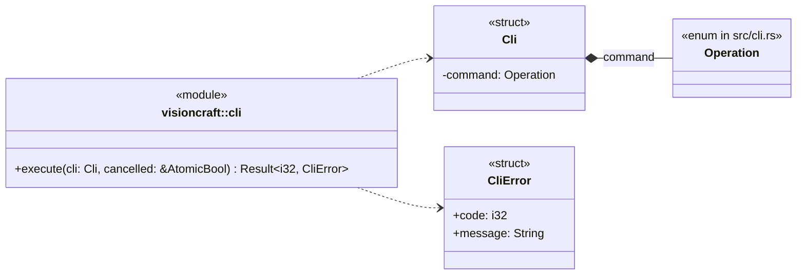
```mermaid
classDiagram
  direction LR
  class visioncraft__cli___tCli["Cli"] {
    <<struct>>
    -command: Operation
  }
  class visioncraft__cli___tCliError["CliError"] {
    <<struct>>
    +code: i32
    +message: String
  }
  class visioncraft__cli["visioncraft::cli"] {
    <<module>>
    +execute(cli: Cli, cancelled: &AtomicBool) Result#lt;i32, CliError#gt;
  }
  class visioncraft__cli___tOperation["Operation"] {
    <<enum in src/cli.rs>>
  }
  visioncraft__cli ..> visioncraft__cli___tCli
  visioncraft__cli ..> visioncraft__cli___tCliError
  visioncraft__cli___tCli *-- visioncraft__cli___tOperation : command
```

## `sym:cargo visioncraft . cli/confined().`
`fn confined(root: &Path, relative: &str, directory: bool) -> Result<PathBuf, CliError>` · L225-L251
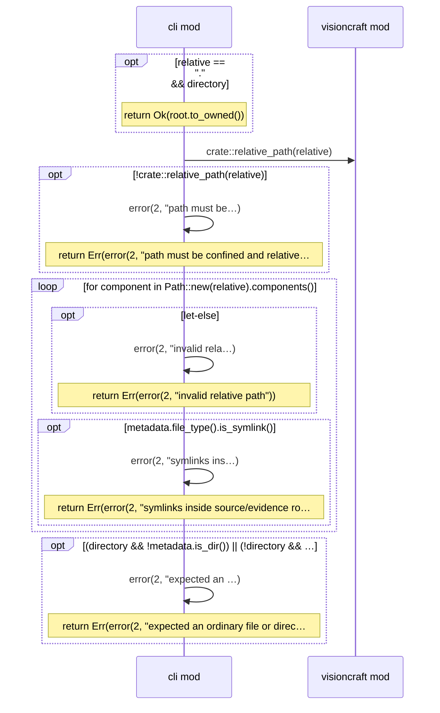
```mermaid
sequenceDiagram
  participant visioncraft__cli as cli mod
  participant visioncraft as visioncraft mod
  opt relative == #quot;.#quot; && directory
    Note over visioncraft__cli: return Ok(root.to_owned())
  end
  visioncraft__cli->>visioncraft: crate::relative_path(relative)
  opt !crate::relative_path(relative)
    visioncraft__cli->>visioncraft__cli: error(2, #quot;path must be…)
    Note over visioncraft__cli: return Err(error(2, #quot;path must be confined and relative…
  end
  loop for component in Path::new(relative).components()
    opt let-else
      visioncraft__cli->>visioncraft__cli: error(2, #quot;invalid rela…)
      Note over visioncraft__cli: return Err(error(2, #quot;invalid relative path#quot;))
    end
    opt metadata.file_type().is_symlink()
      visioncraft__cli->>visioncraft__cli: error(2, #quot;symlinks ins…)
      Note over visioncraft__cli: return Err(error(2, #quot;symlinks inside source/evidence ro…
    end
  end
  opt (directory && !metadata.is_dir()) || (!directory && …
    visioncraft__cli->>visioncraft__cli: error(2, #quot;expected an …)
    Note over visioncraft__cli: return Err(error(2, #quot;expected an ordinary file or direc…
  end
```

## `sym:cargo visioncraft . cli/read_explicit().`
`fn read_explicit(path: &Path, limit: u64) -> Result<(PathBuf, Vec<u8>), CliError>` · L273-L285
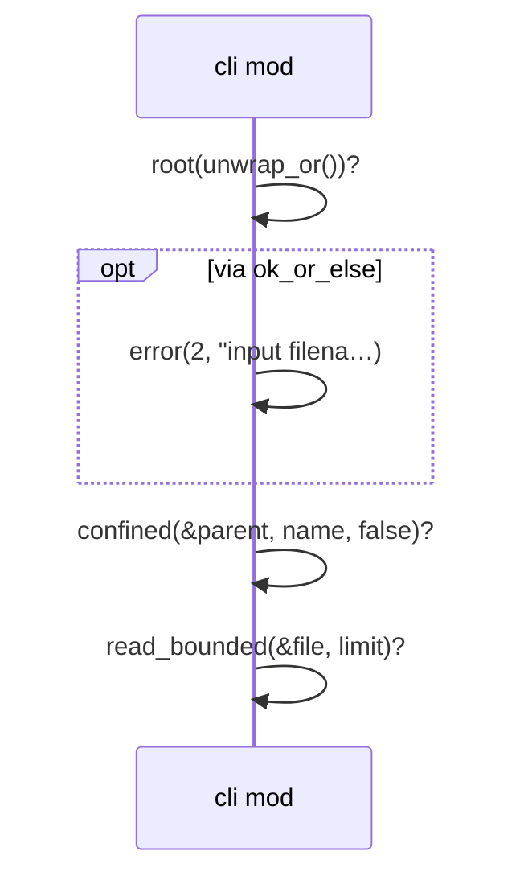
```mermaid
sequenceDiagram
  participant visioncraft__cli as cli mod
  visioncraft__cli->>visioncraft__cli: root(unwrap_or())?
  opt via ok_or_else
    visioncraft__cli->>visioncraft__cli: error(2, #quot;input filena…)
  end
  visioncraft__cli->>visioncraft__cli: confined(&parent, name, false)?
  visioncraft__cli->>visioncraft__cli: read_bounded(&file, limit)?
```

## `sym:cargo visioncraft . cli/output_path().`
`fn output_path(path: &Path) -> Result<PathBuf, CliError>` · L287-L312
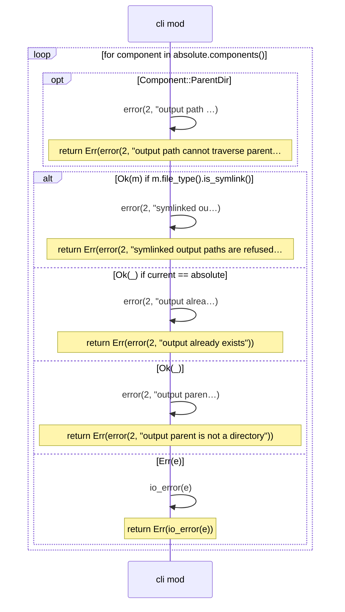
```mermaid
sequenceDiagram
  participant visioncraft__cli as cli mod
  loop for component in absolute.components()
    opt Component::ParentDir
      visioncraft__cli->>visioncraft__cli: error(2, #quot;output path …)
      Note over visioncraft__cli: return Err(error(2, #quot;output path cannot traverse parent…
    end
    alt Ok(m) if m.file_type().is_symlink()
      visioncraft__cli->>visioncraft__cli: error(2, #quot;symlinked ou…)
      Note over visioncraft__cli: return Err(error(2, #quot;symlinked output paths are refused…
    else Ok(_) if current == absolute
      visioncraft__cli->>visioncraft__cli: error(2, #quot;output alrea…)
      Note over visioncraft__cli: return Err(error(2, #quot;output already exists#quot;))
    else Ok(_)
      visioncraft__cli->>visioncraft__cli: error(2, #quot;output paren…)
      Note over visioncraft__cli: return Err(error(2, #quot;output parent is not a directory#quot;))
    else Err(e)
      visioncraft__cli->>visioncraft__cli: io_error(e)
      Note over visioncraft__cli: return Err(io_error(e))
    end
  end
```

## `sym:cargo visioncraft . cli/write_new().`
`fn write_new(path: &Path, bytes: &[u8]) -> Result<(), CliError>` · L314-L326
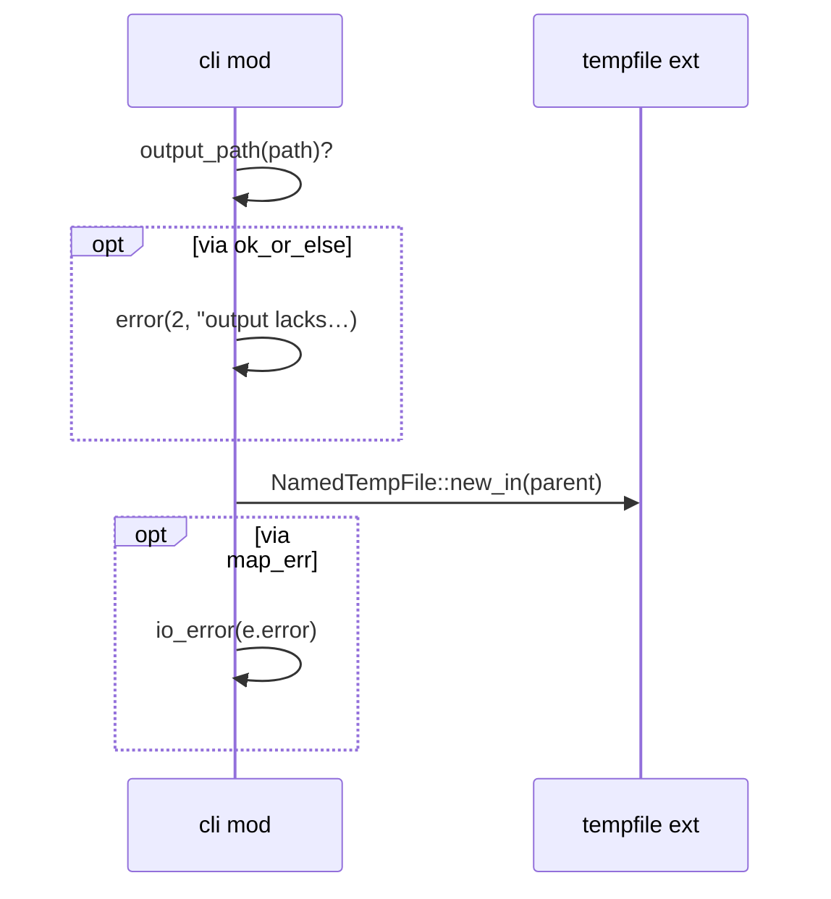
```mermaid
sequenceDiagram
  participant visioncraft__cli as cli mod
  participant _tempfile as tempfile ext
  visioncraft__cli->>visioncraft__cli: output_path(path)?
  opt via ok_or_else
    visioncraft__cli->>visioncraft__cli: error(2, #quot;output lacks…)
  end
  visioncraft__cli->>_tempfile: NamedTempFile::new_in(parent)
  opt via map_err
    visioncraft__cli->>visioncraft__cli: io_error(e.error)
  end
```

## `sym:cargo visioncraft . cli/git().`
`fn git(root: &Path, args: &[&str], cancelled: &AtomicBool) -> Result<GitOutput, CliError>` · L345-L405
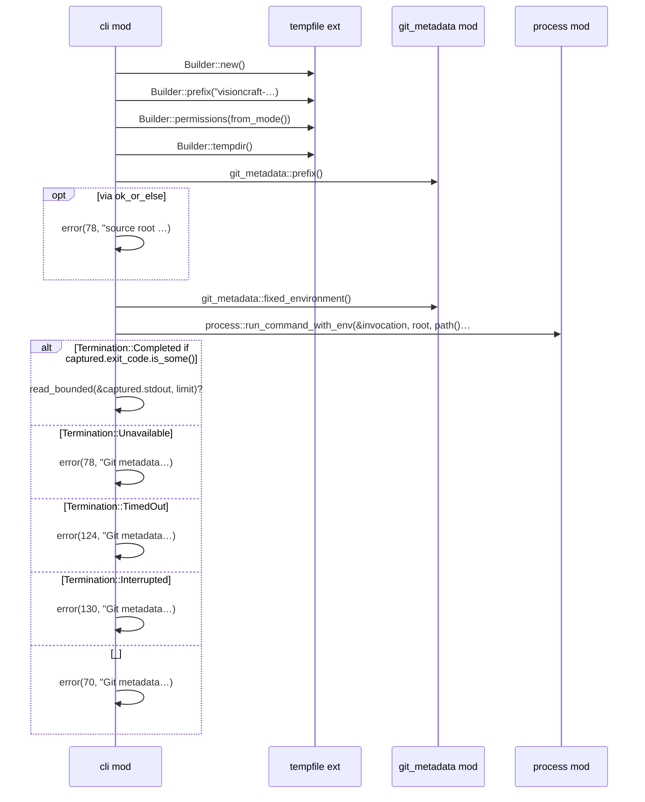
```mermaid
sequenceDiagram
  participant visioncraft__cli as cli mod
  participant _tempfile as tempfile ext
  participant visioncraft__git_metadata as git_metadata mod
  participant visioncraft__process as process mod
  visioncraft__cli->>_tempfile: Builder::new()
  visioncraft__cli->>_tempfile: Builder::prefix(#quot;visioncraft-…)
  visioncraft__cli->>_tempfile: Builder::permissions(from_mode())
  visioncraft__cli->>_tempfile: Builder::tempdir()
  visioncraft__cli->>visioncraft__git_metadata: git_metadata::prefix()
  opt via ok_or_else
    visioncraft__cli->>visioncraft__cli: error(78, #quot;source root …)
  end
  visioncraft__cli->>visioncraft__git_metadata: git_metadata::fixed_environment()
  visioncraft__cli->>visioncraft__process: process::run_command_with_env(&invocation, root, path()…
  alt Termination::Completed if captured.exit_code.is_some()
    visioncraft__cli->>visioncraft__cli: read_bounded(&captured.stdout, limit)?
  else Termination::Unavailable
    visioncraft__cli->>visioncraft__cli: error(78, #quot;Git metadata…)
  else Termination::TimedOut
    visioncraft__cli->>visioncraft__cli: error(124, #quot;Git metadata…)
  else Termination::Interrupted
    visioncraft__cli->>visioncraft__cli: error(130, #quot;Git metadata…)
  else _
    visioncraft__cli->>visioncraft__cli: error(70, #quot;Git metadata…)
  end
```

## `sym:cargo visioncraft . cli/revision().`
`fn revision(root: &Path, cancelled: &AtomicBool) -> Result<String, CliError>` · L407-L417
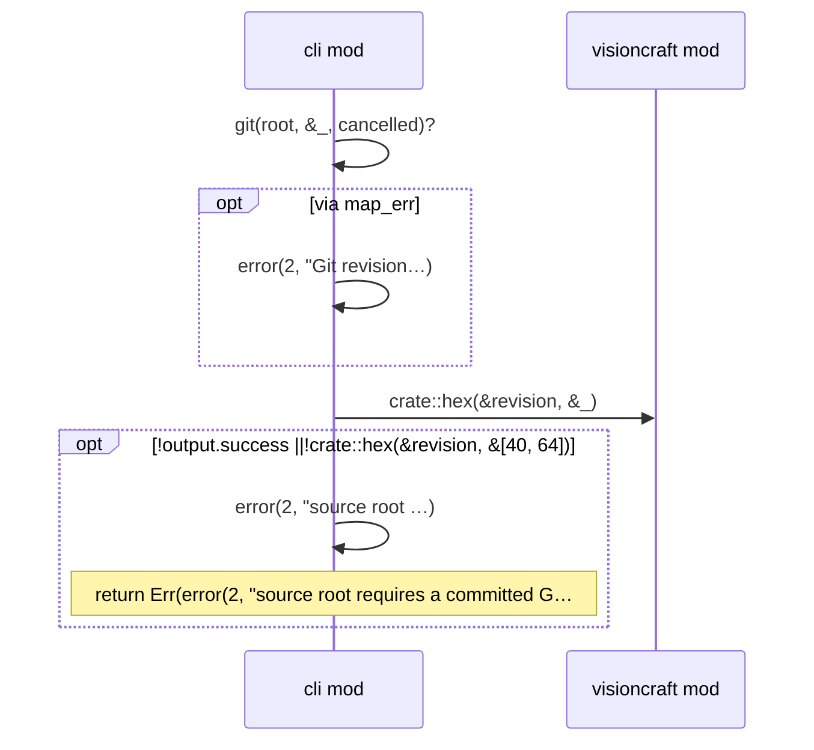
```mermaid
sequenceDiagram
  participant visioncraft__cli as cli mod
  participant visioncraft as visioncraft mod
  visioncraft__cli->>visioncraft__cli: git(root, &_, cancelled)?
  opt via map_err
    visioncraft__cli->>visioncraft__cli: error(2, #quot;Git revision…)
  end
  visioncraft__cli->>visioncraft: crate::hex(&revision, &_)
  opt !output.success ||!crate::hex(&revision, &[40, 64])
    visioncraft__cli->>visioncraft__cli: error(2, #quot;source root …)
    Note over visioncraft__cli: return Err(error(2, #quot;source root requires a committed G…
  end
```

## `sym:cargo visioncraft . cli/selected_dirty().`
`fn selected_dirty(root: &Path, paths: &[String], cancelled: &AtomicBool) -> Result<bool, CliError>` · L419-L484

```mermaid
sequenceDiagram
  participant visioncraft__cli as cli mod
  participant visioncraft as visioncraft mod
  visioncraft__cli->>visioncraft__cli: git(root, &args, cancelled)?
  opt !output.success
    visioncraft__cli->>visioncraft__cli: error(70, #quot;could not in…)
    Note over visioncraft__cli: return Err(error(70, #quot;could not inspect selected Git in…
  end
  loop for row in output.stdout.split(| b | * b == 0).filter(|…
    opt via ok_or_else
      visioncraft__cli->>visioncraft__cli: error(70, #quot;invalid Git …)
    end
    opt via map_err
      visioncraft__cli->>visioncraft__cli: error(70, #quot;invalid Git …)
    end
    opt via map_err
      visioncraft__cli->>visioncraft__cli: error(70, #quot;selected Git…)
    end
  end
  loop for path in paths
    opt let-else
      Note over visioncraft__cli: return Ok(true)
    end
    visioncraft__cli->>visioncraft: crate::hex(object, &_)
    opt !crate::hex(object, &[40, 64])
      visioncraft__cli->>visioncraft__cli: error(70, #quot;invalid Git …)
      Note over visioncraft__cli: return Err(error(70, #quot;invalid Git object identifier#quot;))
    end
    visioncraft__cli->>visioncraft__cli: git(root, &_, cancelled)?
    opt via map_err
      visioncraft__cli->>visioncraft__cli: error(70, #quot;invalid comm…)
    end
    opt !size.success ||!declared.bytes().all(| b | b.is_asc…
      visioncraft__cli->>visioncraft__cli: error(70, #quot;committed bl…)
      Note over visioncraft__cli: return Err(error(70, #quot;committed blob size is unavailabl…
    end
    opt via map_err
      visioncraft__cli->>visioncraft__cli: error(70, #quot;invalid comm…)
    end
    opt declared> MAX_FILE
      visioncraft__cli->>visioncraft__cli: error(2, #quot;committed so…)
      Note over visioncraft__cli: return Err(error(2, #quot;committed source blob exceeds insp…
    end
    visioncraft__cli->>visioncraft__cli: git(root, &_, cancelled)?
    opt !blob.success || blob.stdout.len() as u64 != declared
      visioncraft__cli->>visioncraft__cli: error(70, #quot;committed so…)
      Note over visioncraft__cli: return Err(error(70, #quot;committed source blob is unavaila…
    end
    visioncraft__cli->>visioncraft: crate::sha256(&blob.stdout)
    visioncraft__cli->>visioncraft__cli: confined(root, path, false)
    alt Ok(file)
      visioncraft__cli->>visioncraft__cli: read_bounded(&file, MAX_FILE)?
    else Err(_) if !root.join(path).try_exists().map_err(io_erro…
      Note over visioncraft__cli: return Ok(true)
    else Err(e)
      Note over visioncraft__cli: return Err(e)
    end
    visioncraft__cli->>visioncraft: crate::sha256(&current)
    opt committed_hash != crate::sha256(&current)
      Note over visioncraft__cli: return Ok(true)
    end
  end
```

## `sym:cargo visioncraft . cli/inputs().`
`fn inputs(root: &Path, paths: &[String], missing_ok: bool) -> Result<Vec<Artifact>, CliError>` · L493-L521
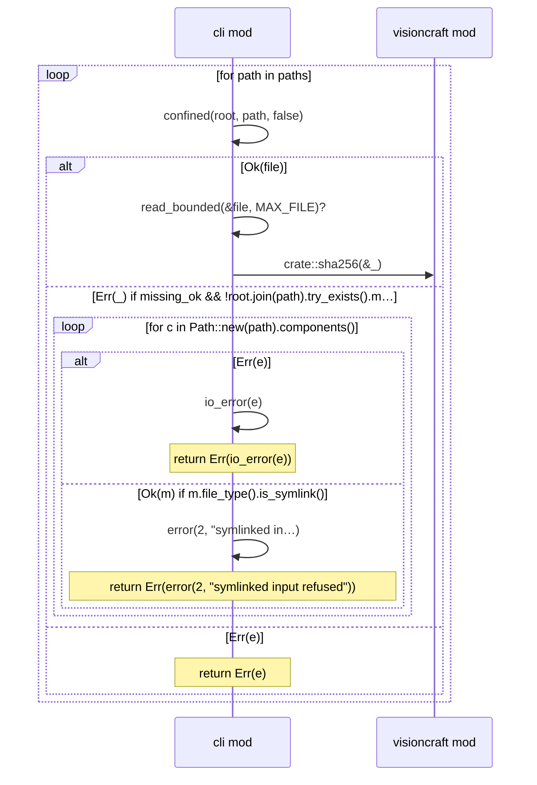
```mermaid
sequenceDiagram
  participant visioncraft__cli as cli mod
  participant visioncraft as visioncraft mod
  loop for path in paths
    visioncraft__cli->>visioncraft__cli: confined(root, path, false)
    alt Ok(file)
      visioncraft__cli->>visioncraft__cli: read_bounded(&file, MAX_FILE)?
      visioncraft__cli->>visioncraft: crate::sha256(&_)
    else Err(_) if missing_ok && !root.join(path).try_exists().m…
      loop for c in Path::new(path).components()
        alt Err(e)
          visioncraft__cli->>visioncraft__cli: io_error(e)
          Note over visioncraft__cli: return Err(io_error(e))
        else Ok(m) if m.file_type().is_symlink()
          visioncraft__cli->>visioncraft__cli: error(2, #quot;symlinked in…)
          Note over visioncraft__cli: return Err(error(2, #quot;symlinked input refused#quot;))
        end
      end
    else Err(e)
      Note over visioncraft__cli: return Err(e)
    end
  end
```

## `sym:cargo visioncraft . cli/source_snapshot().`
`fn source_snapshot(root: &Path, paths: &[String], revision: &str, expected: &[Artifact],) -> Result<Vec<u8>, CliError>` · L523-L557
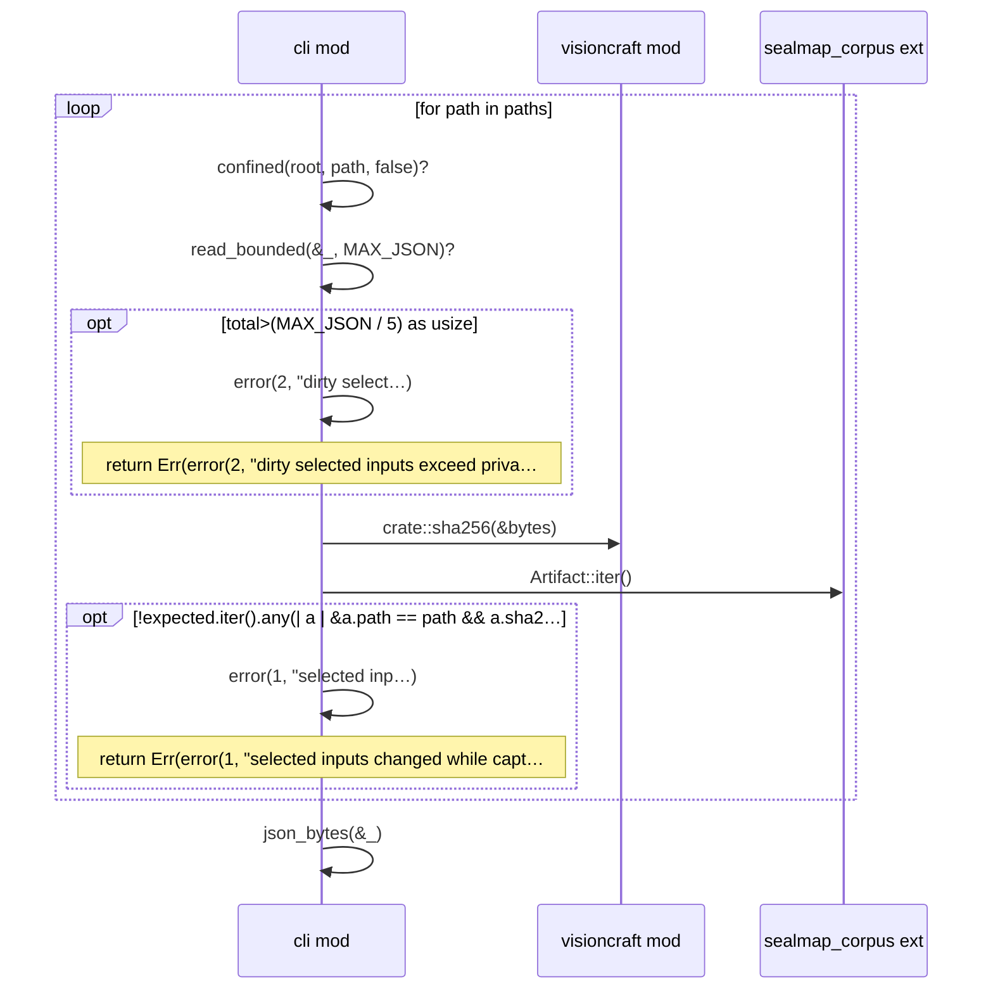
```mermaid
sequenceDiagram
  participant visioncraft__cli as cli mod
  participant visioncraft as visioncraft mod
  participant _sealmap_corpus as sealmap_corpus ext
  loop for path in paths
    visioncraft__cli->>visioncraft__cli: confined(root, path, false)?
    visioncraft__cli->>visioncraft__cli: read_bounded(&_, MAX_JSON)?
    opt total>(MAX_JSON / 5) as usize
      visioncraft__cli->>visioncraft__cli: error(2, #quot;dirty select…)
      Note over visioncraft__cli: return Err(error(2, #quot;dirty selected inputs exceed priva…
    end
    visioncraft__cli->>visioncraft: crate::sha256(&bytes)
    visioncraft__cli->>_sealmap_corpus: Artifact::iter()
    opt !expected.iter().any(| a | &a.path == path && a.sha2…
      visioncraft__cli->>visioncraft__cli: error(1, #quot;selected inp…)
      Note over visioncraft__cli: return Err(error(1, #quot;selected inputs changed while capt…
    end
  end
  visioncraft__cli->>visioncraft__cli: json_bytes(&_)
```

## `sym:cargo visioncraft . cli/init().`
`fn init(options: InitOptions, cancelled: &AtomicBool) -> Result<i32, CliError>` · L564-L652
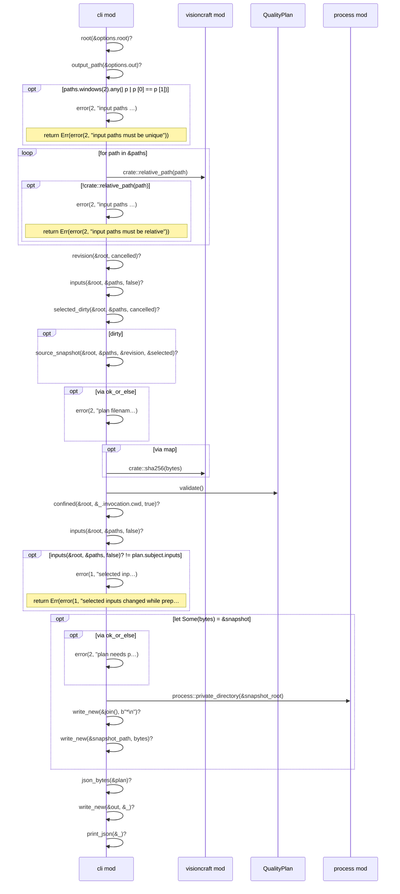
```mermaid
sequenceDiagram
  participant visioncraft__cli as cli mod
  participant visioncraft as visioncraft mod
  participant visioncraft__plan___tQualityPlan as QualityPlan
  participant visioncraft__process as process mod
  visioncraft__cli->>visioncraft__cli: root(&options.root)?
  visioncraft__cli->>visioncraft__cli: output_path(&options.out)?
  opt paths.windows(2).any(| p | p [0] == p [1])
    visioncraft__cli->>visioncraft__cli: error(2, #quot;input paths …)
    Note over visioncraft__cli: return Err(error(2, #quot;input paths must be unique#quot;))
  end
  loop for path in &paths
    visioncraft__cli->>visioncraft: crate::relative_path(path)
    opt !crate::relative_path(path)
      visioncraft__cli->>visioncraft__cli: error(2, #quot;input paths …)
      Note over visioncraft__cli: return Err(error(2, #quot;input paths must be relative#quot;))
    end
  end
  visioncraft__cli->>visioncraft__cli: revision(&root, cancelled)?
  visioncraft__cli->>visioncraft__cli: inputs(&root, &paths, false)?
  visioncraft__cli->>visioncraft__cli: selected_dirty(&root, &paths, cancelled)?
  opt dirty
    visioncraft__cli->>visioncraft__cli: source_snapshot(&root, &paths, &revision, &selected)?
  end
  opt via ok_or_else
    visioncraft__cli->>visioncraft__cli: error(2, #quot;plan filenam…)
  end
  opt via map
    visioncraft__cli->>visioncraft: crate::sha256(bytes)
  end
  visioncraft__cli->>visioncraft__plan___tQualityPlan: validate()
  visioncraft__cli->>visioncraft__cli: confined(&root, &_.invocation.cwd, true)?
  visioncraft__cli->>visioncraft__cli: inputs(&root, &paths, false)?
  opt inputs(&root, &paths, false)? != plan.subject.inputs
    visioncraft__cli->>visioncraft__cli: error(1, #quot;selected inp…)
    Note over visioncraft__cli: return Err(error(1, #quot;selected inputs changed while prep…
  end
  opt let Some(bytes) = &snapshot
    opt via ok_or_else
      visioncraft__cli->>visioncraft__cli: error(2, #quot;plan needs p…)
    end
    visioncraft__cli->>visioncraft__process: process::private_directory(&snapshot_root)
    visioncraft__cli->>visioncraft__cli: write_new(&join(), b#quot;*\n#quot;)?
    visioncraft__cli->>visioncraft__cli: write_new(&snapshot_path, bytes)?
  end
  visioncraft__cli->>visioncraft__cli: json_bytes(&plan)?
  visioncraft__cli->>visioncraft__cli: write_new(&out, &_)?
  visioncraft__cli->>visioncraft__cli: print_json(&_)?
```

## `sym:cargo visioncraft . cli/add_artifact().`
`fn add_artifact(verified: &mut VerifiedArtifacts, root: &Path, artifact: &Artifact,) -> Result<(), CliError>` · L654-L662
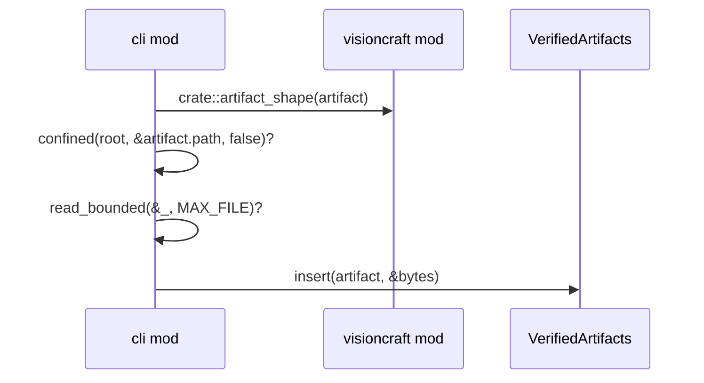
```mermaid
sequenceDiagram
  participant visioncraft__cli as cli mod
  participant visioncraft as visioncraft mod
  participant visioncraft__evidence___tVerifiedArtifacts as VerifiedArtifacts
  visioncraft__cli->>visioncraft: crate::artifact_shape(artifact)
  visioncraft__cli->>visioncraft__cli: confined(root, &artifact.path, false)?
  visioncraft__cli->>visioncraft__cli: read_bounded(&_, MAX_FILE)?
  visioncraft__cli->>visioncraft__evidence___tVerifiedArtifacts: insert(artifact, &bytes)
```

## `sym:cargo visioncraft . cli/evidence_parent().`
`fn evidence_parent(root: &Path, path: &str) -> Result<PathBuf, CliError>` · L674-L685
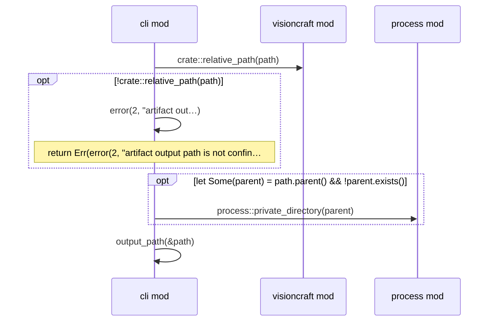
```mermaid
sequenceDiagram
  participant visioncraft__cli as cli mod
  participant visioncraft as visioncraft mod
  participant visioncraft__process as process mod
  visioncraft__cli->>visioncraft: crate::relative_path(path)
  opt !crate::relative_path(path)
    visioncraft__cli->>visioncraft__cli: error(2, #quot;artifact out…)
    Note over visioncraft__cli: return Err(error(2, #quot;artifact output path is not confin…
  end
  opt let Some(parent) = path.parent() && !parent.exists()
    visioncraft__cli->>visioncraft__process: process::private_directory(parent)
  end
  visioncraft__cli->>visioncraft__cli: output_path(&path)
```

## `sym:cargo visioncraft . cli/run().`
`fn run(options: RunOptions, cancelled: &AtomicBool) -> Result<i32, CliError>` · L759-L915

```mermaid
sequenceDiagram
  participant visioncraft__cli as cli mod
  participant visioncraft as visioncraft mod
  participant visioncraft__process as process mod
  participant visioncraft__plan___tQualityPlan as QualityPlan
  participant visioncraft__evidence___tExecutionReceipt as ExecutionReceipt
  visioncraft__cli->>visioncraft__cli: root(&options.root)?
  visioncraft__cli->>visioncraft__cli: read_plan(&options.plan)?
  opt selected.is_empty()
    visioncraft__cli->>visioncraft__cli: error(2, #quot;selected che…)
    Note over visioncraft__cli: return Err(error(2, #quot;selected check does not exist#quot;))
  end
  loop for check in &selected
    opt !matches!(check.evaluator, Evaluator::ExitCode {..})
      visioncraft__cli->>visioncraft__cli: error(78, #quot;reported eva…)
      Note over visioncraft__cli: return Err(error(78, #quot;reported evaluators require their…
    end
    visioncraft__cli->>visioncraft__cli: confined(&source_root, &check.invocation.cwd, true)?
  end
  visioncraft__cli->>visioncraft__cli: revision(&source_root, cancelled)?
  visioncraft__cli->>visioncraft__cli: inputs(&source_root, &paths, false)?
  opt revision(&source_root, cancelled)? != plan.subject.r…
    visioncraft__cli->>visioncraft__cli: error(1, #quot;current sele…)
    Note over visioncraft__cli: return Err(error(1, #quot;current selected source does not m…
  end
  opt let Some(snapshot) = &plan.subject.working_tree
    visioncraft__cli->>visioncraft__cli: confined(&plan_root, &snapshot.path, false)?
    visioncraft__cli->>visioncraft__cli: read_bounded(&_, MAX_JSON)?
    visioncraft__cli->>visioncraft: crate::sha256(&bytes)
    opt crate::sha256(&bytes) != snapshot.sha256
      visioncraft__cli->>visioncraft__cli: error(2, #quot;dirty snapsh…)
      Note over visioncraft__cli: return Err(error(2, #quot;dirty snapshot hash does not match…
    end
  end
  visioncraft__cli->>visioncraft__process: process::private_directory(&options.out)
  visioncraft__cli->>visioncraft__cli: root(&options.out)?
  visioncraft__cli->>visioncraft__cli: write_new(&join(), b#quot;*\n#quot;)?
  visioncraft__cli->>visioncraft__cli: json_bytes(&plan)?
  visioncraft__cli->>visioncraft__cli: write_new(&join(), &_)?
  opt let (Some(snapshot), Some(bytes)) = (&plan.subject.w…
    visioncraft__cli->>visioncraft__cli: evidence_parent(&out, &snapshot.path)?
    visioncraft__cli->>visioncraft__cli: write_new(&_, &bytes)?
  end
  loop for (index, check) in selected.into_iter().enumerate()
    visioncraft__cli->>visioncraft__cli: inputs(&source_root, &paths, false)?
    visioncraft__cli->>visioncraft__cli: revision(&source_root, cancelled)?
    opt inputs(&source_root, &paths, false)? != plan.subject…
      visioncraft__cli->>visioncraft__cli: error(1, #quot;selected inp…)
      Note over visioncraft__cli: return Err(error(1, #quot;selected inputs changed before a l…
    end
    visioncraft__cli->>visioncraft__cli: confined(&source_root, &check.invocation.cwd, true)?
    visioncraft__cli->>visioncraft__process: process::private_directory(&attempt)
    visioncraft__cli->>visioncraft__cli: executable(&check.invocation, &source_root)
    opt resolved.as_ref().is_some_and(| path | path.to_str()…
      visioncraft__cli->>visioncraft__cli: error(78, #quot;resolved exe…)
      Note over visioncraft__cli: return Err(error(78, #quot;resolved executable path is not r…
    end
    opt via and_then
      visioncraft__cli->>visioncraft__cli: read_bounded(path, MAX_FILE)
    end
    opt via map
      visioncraft__cli->>visioncraft: crate::sha256(&bytes)
    end
    visioncraft__cli->>visioncraft__process: process::run_command(&actual_invocation, &source_root, …
    visioncraft__cli->>visioncraft__cli: read_bounded(&captured.stdout, MAX_FILE)?
    visioncraft__cli->>visioncraft: crate::sha256(&_)
    visioncraft__cli->>visioncraft__cli: read_bounded(&captured.stderr, MAX_FILE)?
    visioncraft__cli->>visioncraft: crate::sha256(&_)
    visioncraft__cli->>visioncraft__cli: process_status(captured.termination)
    visioncraft__cli->>visioncraft__cli: inputs(&source_root, &paths, true)
    visioncraft__cli->>visioncraft__plan___tQualityPlan: ~digest()
    visioncraft__cli->>visioncraft__evidence___tExecutionReceipt: validate()
    visioncraft__cli->>visioncraft__cli: json_bytes(&receipt)?
    visioncraft__cli->>visioncraft__cli: write_new(&path, &_)?
    visioncraft__cli->>visioncraft__cli: execution_exit(&receipt, &check.evaluator)
  end
  visioncraft__cli->>visioncraft__cli: print_json(&_)?
```

## `sym:cargo visioncraft . cli/load_receipts().`
`fn load_receipts(directory: &Path, verified: &mut VerifiedArtifacts,) -> Result<Vec<ExecutionReceipt>, CliError>` · L917-L947
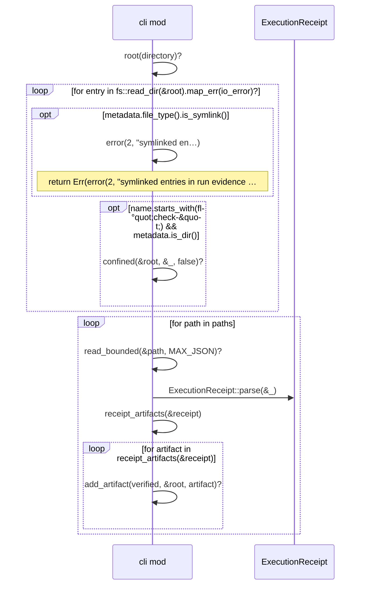
```mermaid
sequenceDiagram
  participant visioncraft__cli as cli mod
  participant visioncraft__evidence___tExecutionReceipt as ExecutionReceipt
  visioncraft__cli->>visioncraft__cli: root(directory)?
  loop for entry in fs::read_dir(&root).map_err(io_error)?
    opt metadata.file_type().is_symlink()
      visioncraft__cli->>visioncraft__cli: error(2, #quot;symlinked en…)
      Note over visioncraft__cli: return Err(error(2, #quot;symlinked entries in run evidence …
    end
    opt name.starts_with(#quot;check-#quot;) && metadata.is_dir()
      visioncraft__cli->>visioncraft__cli: confined(&root, &_, false)?
    end
  end
  loop for path in paths
    visioncraft__cli->>visioncraft__cli: read_bounded(&path, MAX_JSON)?
    visioncraft__cli->>visioncraft__evidence___tExecutionReceipt: ExecutionReceipt::parse(&_)
    visioncraft__cli->>visioncraft__cli: receipt_artifacts(&receipt)
    loop for artifact in receipt_artifacts(&receipt)
      visioncraft__cli->>visioncraft__cli: add_artifact(verified, &root, artifact)?
    end
  end
```

## `sym:cargo visioncraft . cli/evaluate_options().`
`fn evaluate_options(options: EvaluateOptions, cancelled: &AtomicBool) -> Result<i32, CliError>` · L949-L1094
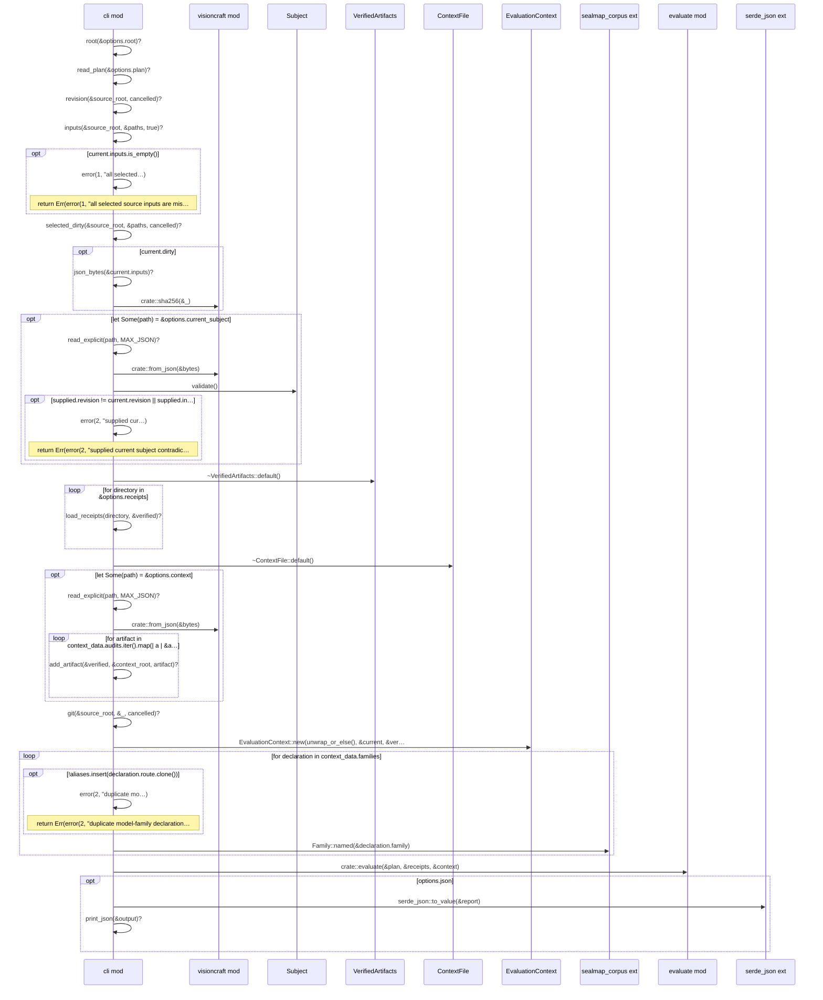
```mermaid
sequenceDiagram
  participant visioncraft__cli as cli mod
  participant visioncraft as visioncraft mod
  participant visioncraft__plan___tSubject as Subject
  participant visioncraft__evidence___tVerifiedArtifacts as VerifiedArtifacts
  participant visioncraft__cli___tContextFile as ContextFile
  participant visioncraft__evaluate___tEvaluationContext as EvaluationContext
  participant _sealmap_corpus as sealmap_corpus ext
  participant visioncraft__evaluate as evaluate mod
  participant _serde_json as serde_json ext
  visioncraft__cli->>visioncraft__cli: root(&options.root)?
  visioncraft__cli->>visioncraft__cli: read_plan(&options.plan)?
  visioncraft__cli->>visioncraft__cli: revision(&source_root, cancelled)?
  visioncraft__cli->>visioncraft__cli: inputs(&source_root, &paths, true)?
  opt current.inputs.is_empty()
    visioncraft__cli->>visioncraft__cli: error(1, #quot;all selected…)
    Note over visioncraft__cli: return Err(error(1, #quot;all selected source inputs are mis…
  end
  visioncraft__cli->>visioncraft__cli: selected_dirty(&source_root, &paths, cancelled)?
  opt current.dirty
    visioncraft__cli->>visioncraft__cli: json_bytes(&current.inputs)?
    visioncraft__cli->>visioncraft: crate::sha256(&_)
  end
  opt let Some(path) = &options.current_subject
    visioncraft__cli->>visioncraft__cli: read_explicit(path, MAX_JSON)?
    visioncraft__cli->>visioncraft: crate::from_json(&bytes)
    visioncraft__cli->>visioncraft__plan___tSubject: validate()
    opt supplied.revision != current.revision || supplied.in…
      visioncraft__cli->>visioncraft__cli: error(2, #quot;supplied cur…)
      Note over visioncraft__cli: return Err(error(2, #quot;supplied current subject contradic…
    end
  end
  visioncraft__cli->>visioncraft__evidence___tVerifiedArtifacts: ~VerifiedArtifacts::default()
  loop for directory in &options.receipts
    visioncraft__cli->>visioncraft__cli: load_receipts(directory, &verified)?
  end
  visioncraft__cli->>visioncraft__cli___tContextFile: ~ContextFile::default()
  opt let Some(path) = &options.context
    visioncraft__cli->>visioncraft__cli: read_explicit(path, MAX_JSON)?
    visioncraft__cli->>visioncraft: crate::from_json(&bytes)
    loop for artifact in context_data.audits.iter().map(| a | &a…
      visioncraft__cli->>visioncraft__cli: add_artifact(&verified, &context_root, artifact)?
    end
  end
  visioncraft__cli->>visioncraft__cli: git(&source_root, &_, cancelled)?
  visioncraft__cli->>visioncraft__evaluate___tEvaluationContext: EvaluationContext::new(unwrap_or_else(), &current, &ver…
  loop for declaration in context_data.families
    opt !aliases.insert(declaration.route.clone())
      visioncraft__cli->>visioncraft__cli: error(2, #quot;duplicate mo…)
      Note over visioncraft__cli: return Err(error(2, #quot;duplicate model-family declaration…
    end
    visioncraft__cli->>_sealmap_corpus: Family::named(&declaration.family)
  end
  visioncraft__cli->>visioncraft__evaluate: crate::evaluate(&plan, &receipts, &context)
  opt options.json
    visioncraft__cli->>_serde_json: serde_json::to_value(&report)
    visioncraft__cli->>visioncraft__cli: print_json(&output)?
  end
```

## `sym:cargo visioncraft . cli/execute().`
`pub fn execute(cli: Cli, cancelled: &AtomicBool) -> Result<i32, CliError>` · L1096-L1135
> Dispatch an explicit CLI operation.
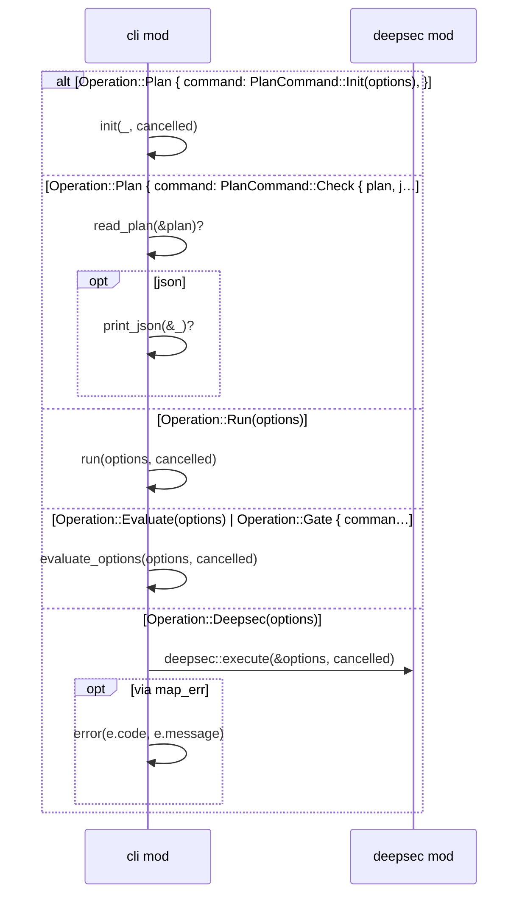
```mermaid
sequenceDiagram
  participant visioncraft__cli as cli mod
  participant visioncraft__deepsec as deepsec mod
  alt Operation::Plan { command: PlanCommand::Init(options), }
    visioncraft__cli->>visioncraft__cli: init(_, cancelled)
  else Operation::Plan { command: PlanCommand::Check { plan, j…
    visioncraft__cli->>visioncraft__cli: read_plan(&plan)?
    opt json
      visioncraft__cli->>visioncraft__cli: print_json(&_)?
    end
  else Operation::Run(options)
    visioncraft__cli->>visioncraft__cli: run(options, cancelled)
  else Operation::Evaluate(options) | Operation::Gate { comman…
    visioncraft__cli->>visioncraft__cli: evaluate_options(options, cancelled)
  else Operation::Deepsec(options)
    visioncraft__cli->>visioncraft__deepsec: deepsec::execute(&options, cancelled)
    opt via map_err
      visioncraft__cli->>visioncraft__cli: error(e.code, e.message)
    end
  end
```
