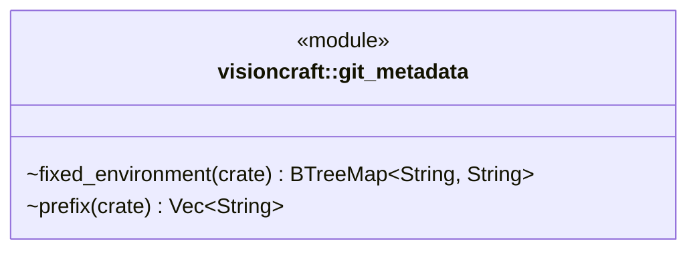

# `sym:cargo visioncraft . git_metadata/` · src/git_metadata.rs
> Shared policy for read-only Git metadata inspection, not user build commands.

## structure

```mermaid
classDiagram
  direction LR
  class visioncraft__git_metadata["visioncraft::git_metadata"] {
    <<module>>
    ~fixed_environment(crate) BTreeMap#lt;String, String#gt;
    ~prefix(crate) Vec#lt;String#gt;
  }
```
