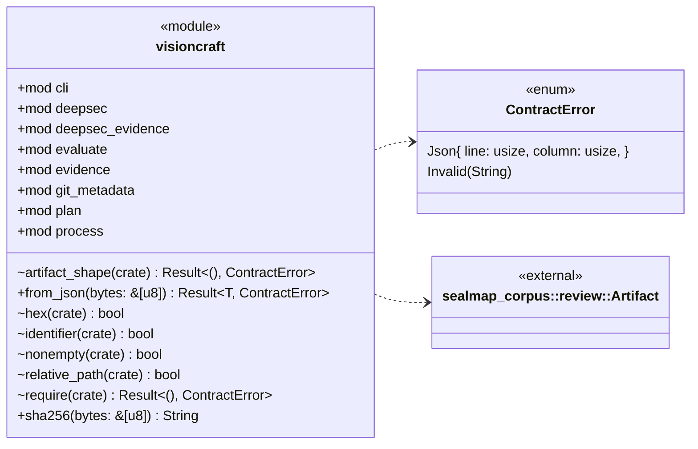

# `sym:cargo visioncraft .` · src/lib.rs
> Explicit quality contracts, without implicit execution or claims of correctness.

## structure

```mermaid
classDiagram
  direction LR
  class visioncraft___tContractError["ContractError"] {
    <<enum>>
    Json#123; line: usize, column: usize, #125;
    Invalid#40;String#41;
  }
  class visioncraft {
    <<module>>
    ~artifact_shape(crate) Result#lt;#40;#41;, ContractError#gt;
    +mod cli
    +mod deepsec
    +mod deepsec_evidence
    +mod evaluate
    +mod evidence
    +from_json(bytes: &[u8]) Result#lt;T, ContractError#gt;
    +mod git_metadata
    ~hex(crate) bool
    ~identifier(crate) bool
    ~nonempty(crate) bool
    +mod plan
    +mod process
    ~relative_path(crate) bool
    ~require(crate) Result#lt;#40;#41;, ContractError#gt;
    +sha256(bytes: &[u8]) String
  }
  class _sealmap_corpus__review__Artifact["sealmap_corpus::review::Artifact"] {
    <<external>>
  }
  visioncraft ..> visioncraft___tContractError
  visioncraft ..> _sealmap_corpus__review__Artifact
```
