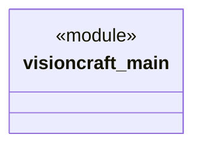

# `sym:cargo visioncraft_main .` · src/main.rs
> VisionCraft's explicit command-line entry point and cancellation bridge.

## structure

```mermaid
classDiagram
  direction LR
  class visioncraft_main {
    <<module>>
  }
```
